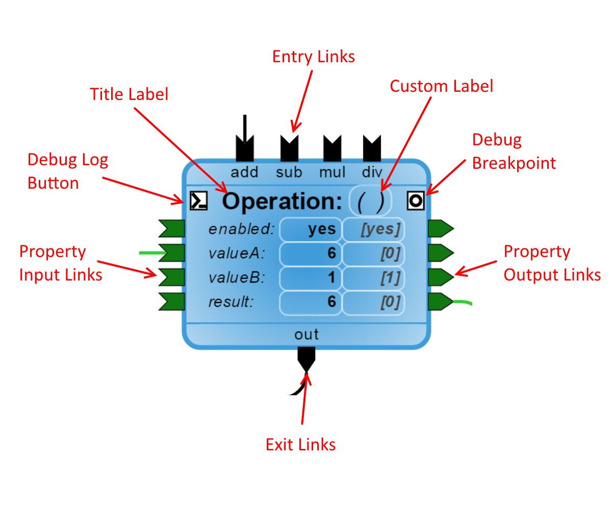

The most important part of wcPlay's node based scripting system is the node! Let's dig into how they work and how you will be interacting with them. We'll start with an extreme closeup of a node:

****
### Title Area ###

The node type is the large bold text label near the top of the node. Any custom Title name will appear between the parenthesis '()' beside it, you can click on this to change it at any time. The custom title will appear in debug log messages made by that node (if any), some nodes may actually use the title for something significant.

Further to the right of the title name is the information detail button, clicking on this will show a dialog that further explains what the node does (as defined by the node itself).

****
### Properties ###

Properties make up the center area of the node. Each property takes up a row, and are made up of three columns; their name, their current (or volatile) value, and their initial (or default) value. The current value is what the script uses throughout execution and can change. The initial value is the value that is saved to your script file, and is what the current value begins with when the script starts.

****
### Chaining ###

Chains determine the flow of your script as they connect nodes together into sequences. They are the curved lines that make a connection between two nodes. There are two types of chains, flow and property.

#### Flow Chains ####

Flow chains make up the overall flow of your script. They are responsible for activating new nodes and then continueing to the next. Chains can simply be linear, or can split into multiple parallel chains.

A node connects to a flow chain through thier `Flow Links` located at its top and bottom.  The `Flow Entry Links` appearing at the top will trigger the activation of the node while the `Flow Exit Links` appearing at the bottom will continue the flow.

The example node above has four flow entry links, 'add', 'sub', 'mul', and 'div'. It also has a single flow exit link named, 'out'. This node will perform a simple math operation, either addition, subtraction, multiplication, or division between properties 'valueA' and 'valueB'. Once it has finished, it will assign the result of the operation to the 'result' property and trigger the 'out' link.

#### Property Chains ####

Property chains handle all of the information traffic between nodes by passing data from one to another. Data always passes from the `Property Output Link` on the right side of a node to a `Property Input Link` on the left side of another.

In the example above, an operation is done between property 'valueA' and property 'valueB', and then copied into the property 'result'. When the result has been assigned its new value, it will activate its output link to send that new value to all other properties attached to it, and so on.

****
### Debugging ###

For debugging, each node comes with two toggle buttons that appear as squares on the left and right side of the title label. The left side enables debug logging which will output messages to the browsers console log whenever various parts of the node are activated. The right side toggles a breakpoint on your node which causes the execution of the script to pause whenever that node is activated. More information about the breakpoint system can be found in the {@tutorial 3.0} tutorial.

****
Return to the {@tutorial 1.0} tutorial.  
Continue to the {@tutorial 3.0} tutorial.  