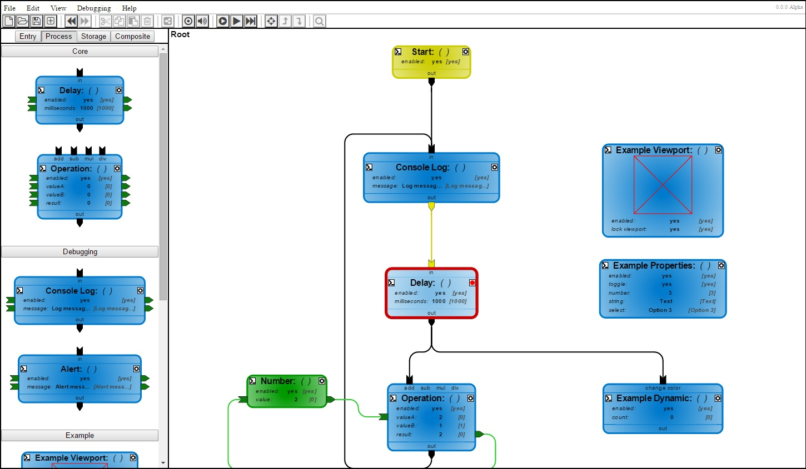

Debugging is a very important aspect of developing. It allows the developer to closely inspect the actions of their script in order to ensure that it behaves correctly.

****
### Debug Log ###

The most basic method of debugging is to print debug logs to a console. By toggling debug logging on a node, any time a flow link is activated or property is changed, a console message will appear in the browsers console. This is a useful feature as it doesn't interrupt the execution of your script, but it may become overwhelming with too many log messages.

****
### Breakpoints ###

The breakpoint system is where wcPlay really shines! When a node is toggled as a breakpoint and it becomes activated, your script will automatically pause execution and the editor will display that node in red. From here, you can step one update at a time and follow the flow of your script at your own pace.

You can step the debugger with the step () button on the toolbar or with the `spacebar` key. Once you are finished debugging, or just want to continue running your script, un-toggle the pause () button or press the `enter` key. Make sure to toggle off the breakpoint of the node unless you want it to pause again the next time it activates.

****
### Debug Stepping ###

The debug stepping process may seem a little confusing at first, but each step basically follows these rules:
- As soon as a node turns red, it has been activated, but not yet processed.
- A step of the debugger will execute the action of the node, which may change properties and/or activate flow exit links.
- If properties are changed, those values are propagated through the property chain system until every property in that chain has processed. It is important that property values propagate first, as nodes next in the flow chain may need to use them immediately upon activation.
- If flow exit links are activated, all nodes directly connected will activate.
- Chains that split to multiple nodes, or multiple flow entry links, will run in parallel to each other.

****
Return to the {@tutorial 2.0} tutorial.  
Continue to the {@tutorial 4.0} tutorial.  